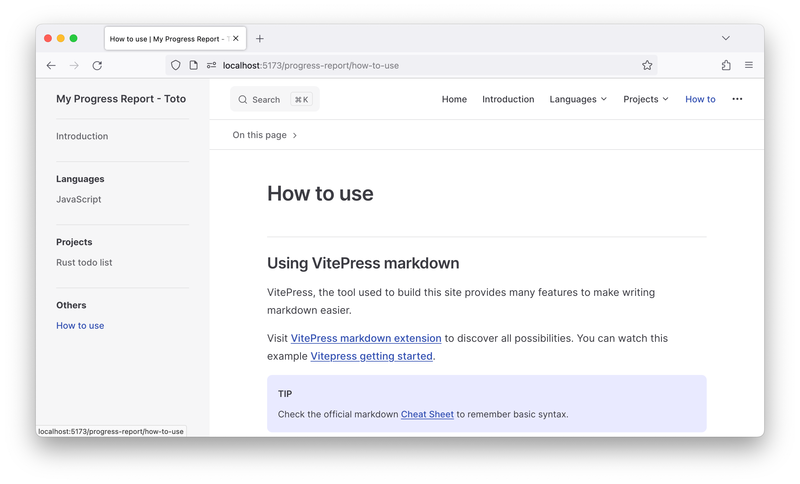

# How to use

## Using VitePress markdown

VitePress, the tool used to build this site provides many features to make writing markdown easier.

Visit [VitePress markdown extension](https://vitepress.dev/guide/markdown) to discover all possibilities. You can watch this example [Vitepress getting started](https://github.com/vuejs/vitepress/blob/main/docs/guide/getting-started.md?plain=1).

::: tip
Check the official markdown [Cheat Sheet](https://www.markdownguide.org/cheat-sheet/) to remember basic syntax.
:::

### Some simple examples

**Use standard markdown**

```md
# This is a title
## Subtitle

**bold**

- list
- list

> quote
```

**Use code blocks** to demonstrate examples

````md
```js
function hello() {
  console.log('Hello, World!')
}
```
````

**Emojis** wit :: notation
```md
:smile:
```
:smile:

### Custom components

You can use custom components to add more complex content to your markdown files.

**Example of markdown :**
```md
::: info
This is an info box.
:::

::: tip
This is a tip.
:::

::: warning
This is a warning.
:::
```
**Will output**
::: info
This is an info box.
:::

::: tip
This is a tip.
:::

::: warning
This is a warning.
:::

**Badges**
```mdx
<Badge type="tip" text="Info" />
```

**Will output**
<Badge type="tip" text="Info" />

See [VitePress markdown extension](https://vitepress.dev/guide/markdown) for more details.


## Adding assets

You can add assets to your markdown files by placing them in the same folder as the markdown file or in a subfolder. Then you can reference them using relative links.

```md

```


## Start you repo

Check the README of the [Github template](https://github.com/jobtrek/progress-report) to see installation and setup instructions.
