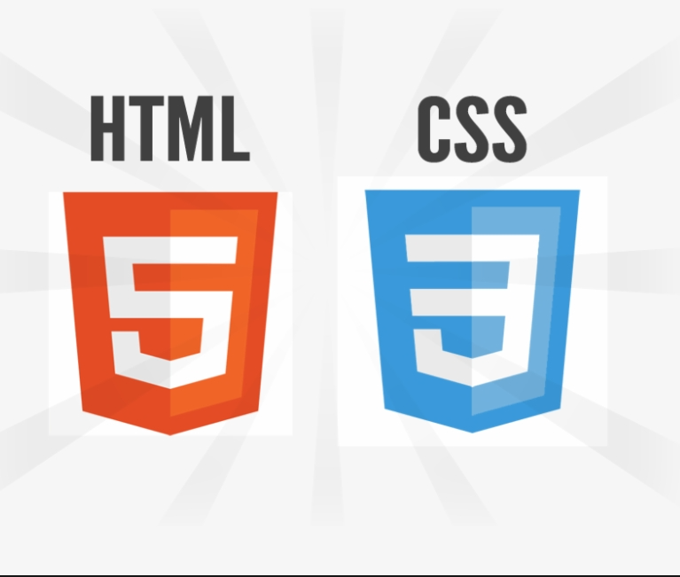

# Html <Badge type="tip" text="html and CSS" />



**Html and CSS are markup languages used to \
structure and style a website using html tags and CSS\
classes.**


## Html basic structure <Badge type="tip" text="" />

```html
<!DOCTYPE html>

<html>

  <head>

    <meta charset="utf-8">

    <title>Title of the page</title>

  </head>

  <body>

  </body>

</html>

```
\
In HTML, all content is framed in the "body" tag, which is where content is added. The "Head" tag will contain the \
various links to libraries, CSS or JavaScript files.


## CSS basic 

```CSS
p {
  color: red;
}
```
\
En CSS si on veut modifier un élément il suffit d'appeler l'élément dans un fichier en lui donnant un attribut CSS. \
Par exemple ici tout le contenu se trouvant dans une balise P sera en rouge.


[WebSite static](../projects/html-WebSite-Static.md)
