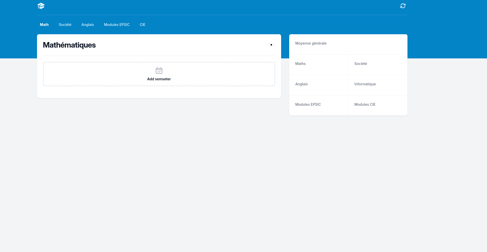
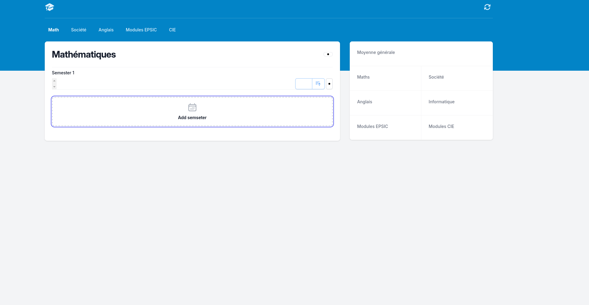
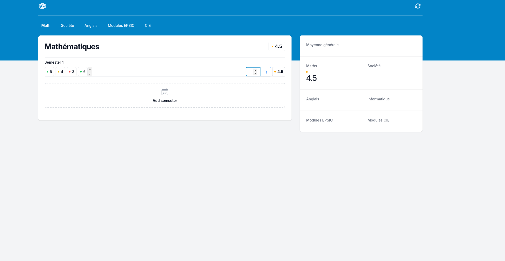

# Grade-view <Badge type="tip" text="JavaScript" />

Grade-View is a project I was able to carry out in JavaScript.\
The objective was to create a script to make a site dynamic. \
The script had to enable the user to create semesters by clicking on a button, \
then add grades in a semester to be able to average a semester to be able to calculate \
the total average of all semesters.

**Seen without semester**

**Seen with semester**

**Seen with semester and note**

