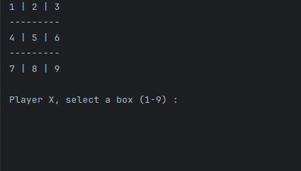
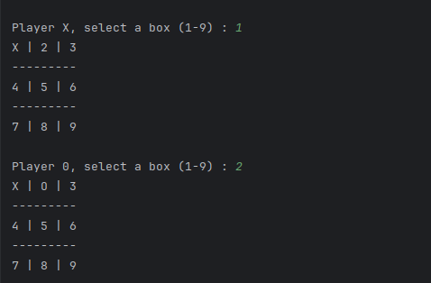
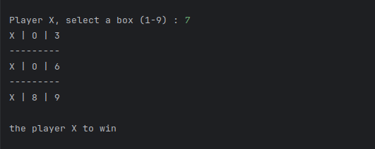

# Tic-Tac-Toe-Java<Badge type="tip" text="Tic-Tac-Toe-Java" />

In Java, I created a Tic-Tac-Toe game where one player \
chooses the number of the square he wants, then the second \
player chooses his square, and a message appears when \
one of the two players wins.

**First player**

**Second player**

**Win**

