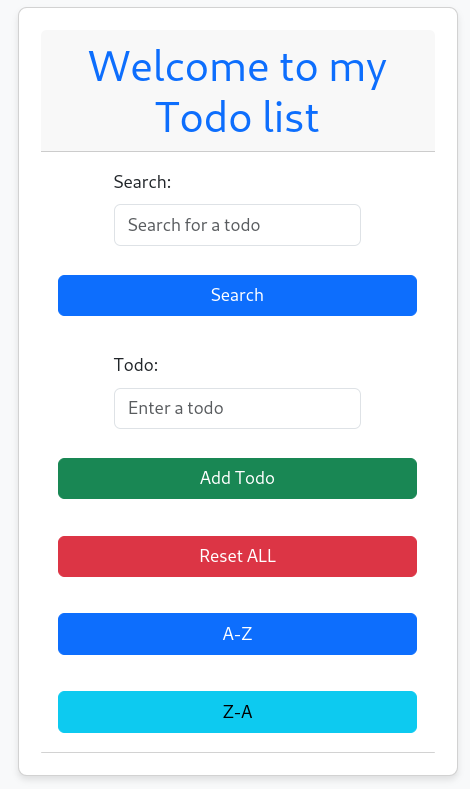
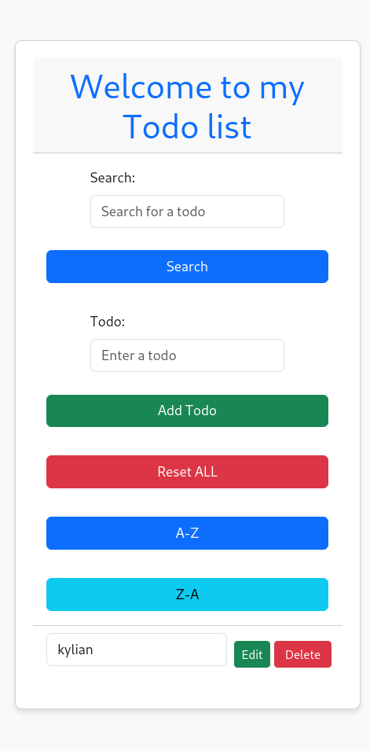

#  Todo-list<Badge type="tip" text="PHP,Slim,Twig,sqlite" />

Durant ma formation j'ai eu à réaliser une todo-list avec PHP, Slim et Twig.\
J'ai utilisé Slim pour la partie backend et Twig pour la partie frontend.\
J'ai utilisé une base de donnée sqlite pour stocker les tâches.\
Pour le css j'ai utilisé bootstrap.

## Aperçu de base



## Fonctionnalités

- Ajouter une tâche
- Supprimer une tâche
- Supprimer toutes les tâches
- Trier les tâches de A à Z
- Trier les tâches de Z à A
- Rechercher une tâche
- Modifier une tâche
- Supprimer une tâche


## Code


### Connexion à la base de donnée
```php
<?php
session_start();
require __DIR__ . '/../vendor/autoload.php';

// if ($_SERVER['REQUEST_METHOD'] === 'GET') dump($_SESSION);

use Slim\Factory\AppFactory;
use Slim\Views\Twig;
use Slim\Views\TwigMiddleware;
use Zefflo99\PhpExample2\Router;
use Zefflo99\PhpExample2\TodoRepository;


$host = __DIR__ . '/../database.db';
$dsn = "sqlite:$host";
$options = [
    PDO::ATTR_ERRMODE            => PDO::ERRMODE_EXCEPTION,
    PDO::ATTR_DEFAULT_FETCH_MODE => PDO::FETCH_ASSOC,
    PDO::ATTR_EMULATE_PREPARES   => false,
];
$pdo = new PDO($dsn, null, null, $options);


$app = AppFactory::create();
$twig = Twig::create(__DIR__ . '/../template', ['cache' => false]);
$app->add(TwigMiddleware::create($app, $twig));

$app->addRoutingMiddleware();
$errorMiddleware = $app->addErrorMiddleware(true, true, true);

$todoRepository = new TodoRepository($pdo);

Router::Init($app, $todoRepository, $pdo);

$app->run();
```

### Aperçu lorsque que une todo est ajouté





## Fonctionnalités

### Ajouter une tâche

```php
 $app->get('/', function (Request $request, Response $response) use ($todoRepository) {
            $todos = $todoRepository->getAllTodos();

            $success = $_SESSION['success'];
            $error = $_SESSION['error'];
            unset($_SESSION['success']);
            unset($_SESSION['error']);

            $view = Twig::fromRequest($request);
            return $view->render($response, 'todo.twig', [
                'todos' => $todos,
                'success' => $success,
                'error' => $error
            ]);
        });
```

### Supprimer une tâche

```php

$app->post('/delete', function (Request $request, Response $response) use ($todoRepository, $pdo) {
            $pdo->prepare("delete from todo where id = ?")->execute([$_POST["todoId"]]);
            return $response->withHeader('Location', '/')->withStatus(302);
        });
```

### Supprimer toutes les tâches

```php

 $app->post('/deleteAll', function (Request $request, Response $response) use ($todoRepository, $pdo) {
            $pdo->prepare("delete from todo")->execute();
            return $response->withHeader('Location', '/')->withStatus(302);
        });
```

### Trier les tâches de A à Z

```php

$app->get('/sortAZ', function (Request $request, Response $response) use ($todoRepository) {
            $todos = $todoRepository->getAllTodos();

            usort($todos, function ($a, $b) {
                return strcmp($a['name'], $b['name']);
            });

            $view = Twig::fromRequest($request);
            return $view->render($response, 'todo.twig', [
                'todos' => $todos,
            ]);
        });
```

### Trier les tâches de Z à A

```php

$app->get('/sortZA', function (Request $request, Response $response) use ($todoRepository) {
            $todos = $todoRepository->getAllTodos();

            usort($todos, function ($a, $b) {
                return strcmp($b['name'], $a['name']);
            });

            $view = Twig::fromRequest($request);
            return $view->render($response, 'todo.twig', [
                'todos' => $todos,
            ]);
        });
```


### Recherche d'une tâche

```php

$app->get('/sortAZ', function (Request $request, Response $response) use ($todoRepository) {
            $todos = $todoRepository->getAllTodos();

            usort($todos, function ($a, $b) {
                return strcmp($a['name'], $b['name']);
            });

            $view = Twig::fromRequest($request);
            return $view->render($response, 'todo.twig', [
                'todos' => $todos,
            ]);
        });
```


### Modifier une tâche

```php

$app->post('/edit', function (Request $request, Response $response) use ($todoRepository) {
            $newValue = $_POST['editTodo'];
            $todoId = $_POST['todoId'];
            $todoRepository->editTodo($todoId, $newValue);

            return $response->withHeader('Location', '/')->withStatus(302);
        });

```

## Documentation

- [Documentation](https://www.php.net/docs.php)


